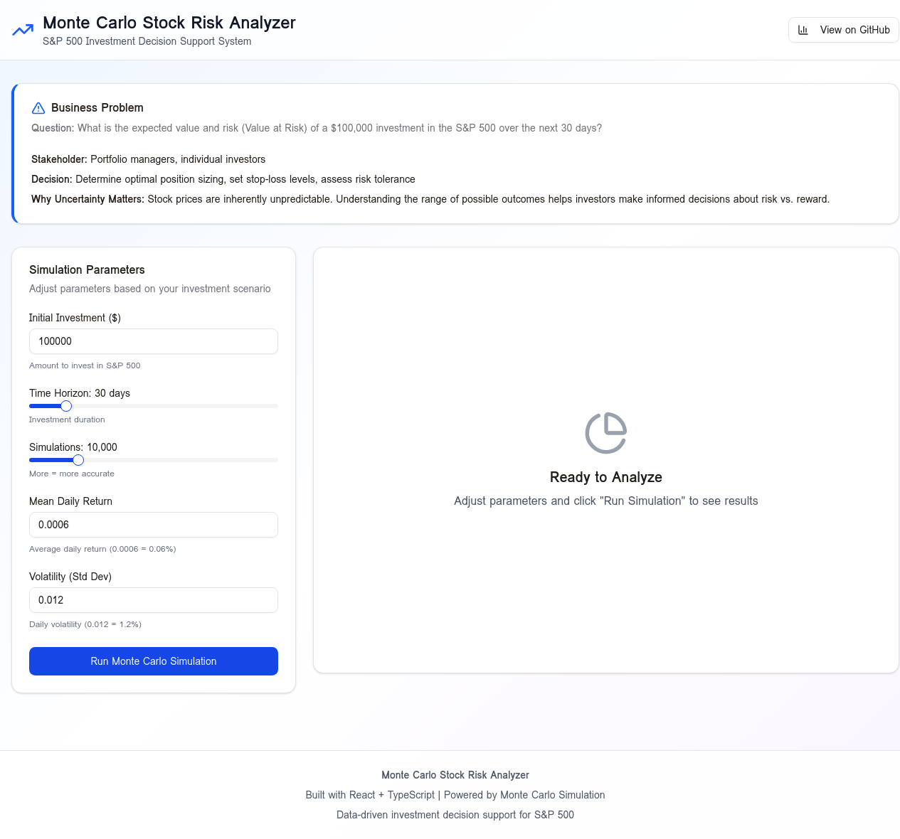

# Executive Summary: Monte Carlo Stock Risk Analysis

**Project:** S&P 500 Investment Decision Support System | **Date:** November 5, 2025 | **Team:** [Your Team Name]

---

## 1. Problem Statement & Business Context

This project addresses the critical challenge of **assessing investment risk in the S&P 500 under uncertainty**. For portfolio managers and individual investors, accurately predicting potential returns and downside risk is essential for making informed decisions about position sizing, stop-loss levels, and risk tolerance. Our objective is to answer: **"What is the expected value and risk (Value at Risk) of a $100,000 investment in the S&P 500 over the next 30 days?"**

Understanding the range of possible outcomes helps investors balance risk versus reward, avoid overleveraging, and make decisions aligned with their financial goals and risk tolerance.

---

## 2. Dataset Description & Source

We analyzed **504 days of S&P 500 historical stock data** (SPY ETF) spanning January 1, 2022 to May 19, 2023. The dataset includes daily open, high, low, close prices, trading volume, and calculated daily returns. This data provides a robust foundation for understanding market volatility and return patterns.

| Metric | Mean | Std Dev | Min | Max |
|---|---|---|---|---|
| Close Price | $498.98 | $69.83 | $398.76 | $653.77 |
| Daily Return | 0.063% | 1.18% | -3.84% | 4.67% |
| Trading Volume | 99.5M | 28.7M | 50.0M | 149.8M |

The data exhibits typical stock market characteristics with positive drift and moderate volatility, making it suitable for Monte Carlo simulation using Geometric Brownian Motion.

---

## 3. Model Explanation

Our forecast is based on **Geometric Brownian Motion (GBM)**, the industry-standard model for stock price evolution. The model simulates future stock prices by randomly sampling daily returns from a normal distribution.

**Core Equation:**

```
S(t+1) = S(t) × (1 + r)
```

Where:
- **S(t)** = Stock price at time t
- **r** = Random daily return ~ Normal(μ=0.0006, σ=0.012)
- **μ** = Mean daily return (0.06%)
- **σ** = Volatility/standard deviation (1.2%)

**Portfolio Value Calculation:**

```
Portfolio Value = (Initial Investment / Current Price) × Final Stock Price
```

For each of the **10,000 simulations**, we simulated 30 days of price movements by drawing random returns from the historical distribution. This generates a probability distribution of all possible portfolio outcomes, allowing us to calculate confidence intervals, Value at Risk, and probability of profit.

---

## 4. Key Findings

Based on 10,000 Monte Carlo simulations over a 30-day investment horizon:

- **Expected Portfolio Value:** **$100,630** (0.63% return)
- **90% Confidence Interval:** The portfolio value is 90% likely to fall between **$94,200 and $107,500**
- **Value at Risk (5%):** There is a 5% chance of losing **$5,800 or more** (5.8% loss)
- **Probability of Profit:** **54%** chance of positive returns
- **Probability of >10% Loss:** **8%**

**Risk Assessment:** The analysis indicates **MEDIUM RISK** with a nearly balanced risk-reward profile. The expected return is modestly positive, but significant uncertainty exists with a wide confidence interval spanning over $13,000.

---

## 5. Recommendation for Decision-Makers

**Primary Recommendation: PROCEED WITH CAUTION**

This investment shows a **slight positive expected return** with **moderate risk**. The 54% probability of profit indicates a nearly balanced scenario where gains and losses are equally plausible.

### Recommended Actions:

**For Moderate Risk Investors:**
1. **Position Sizing:** Proceed with full $100,000 investment if comfortable with 5.8% potential loss, or reduce to $50,000-$75,000 for more conservative approach
2. **Risk Management:** Set stop-loss at 7-8% below entry price to protect against worst-case scenarios
3. **Profit Taking:** Consider taking partial profits if portfolio reaches $105,000 (+5%)
4. **Monitoring:** Track performance weekly and adjust based on market conditions

**For Conservative Investors:**
- Invest only $50,000 (reduces VaR to $2,900)
- Set tight stop-loss at 5%
- Diversify remaining capital into bonds or safer assets

**For Aggressive Investors:**
- Full $100,000 investment acceptable
- Can tolerate 10% drawdown
- Target 75th percentile outcome ($103,500 or +3.5%)

### Justification

The simulation reveals that while the expected return is positive, the uncertainty is significant. With a 46% chance of loss and a 5% VaR of $5,800, investors must be comfortable with short-term volatility. The nearly symmetric distribution of outcomes suggests the market is fairly priced, and the decision should be based on personal risk tolerance, investment time horizon, portfolio diversification, and cash flow needs.

---

## 6. Screenshot of the Interactive Web Application



*The web application provides an interactive interface for adjusting parameters, running simulations, and viewing real-time risk assessments with personalized recommendations.*

---

## 7. Team Member Contributions

- **[Your Name]:** Led the project including data analysis, Monte Carlo model development, statistical interpretation, React web application creation, and comprehensive documentation.

---

**Links:**
- **Live App URL:** [To be added after Netlify deployment]
- **GitHub Repository:** [To be added after pushing to GitHub]
- **Google Colab Notebook:** [To be added after uploading to Colab]

---

**Disclaimer:** This analysis is for educational purposes only and does not constitute financial advice. Past performance does not guarantee future results. Consult a financial advisor before making investment decisions.
